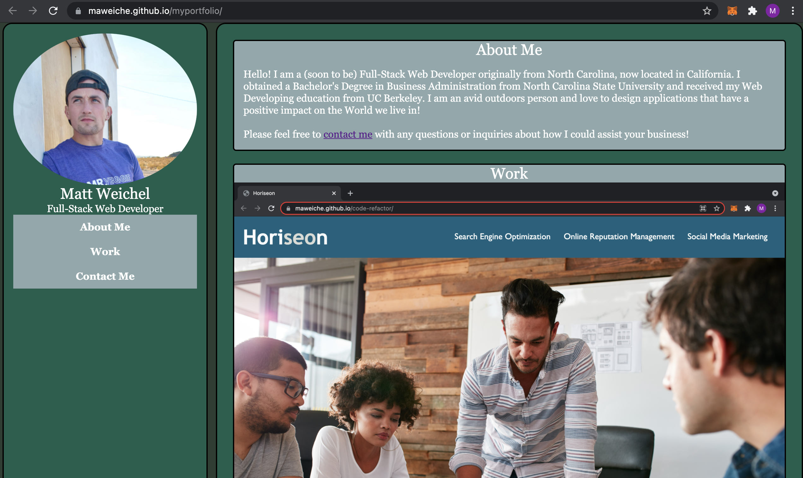

# My Portfolio

The objective of this project was to create a portfolio displaying work samples of a potential employee (myself) to allow a future employer to assess whether this is a good candidate for an open position.

### Screenshot

## Built With

* [HTML](https://developer.mozilla.org/en-US/docs/Web/HTML)
* [CSS](https://developer.mozilla.org/en-US/docs/Web/CSS)

## Deployed Link

* [See Live Site](https://maweiche.github.io/myportfolio/)

## Authors

* **Matt Weichel** 

- [Link to Portfolio Site](https://maweiche.github.io/myportfolio/)
- [Link to Github](https://github.com/maweiche/)

## License

This project is licensed under the MIT License 

## Acknowledgments

* Hat tip to anyone whose code, libraries, packages, or UI was used  / inspired from
* Thank you to Jerome, Cheng, Manuel, and Daniel
